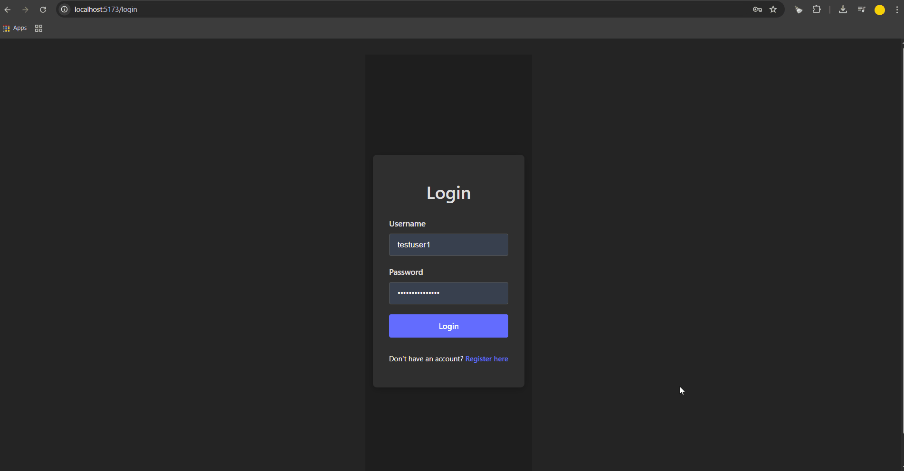

# Smart Group Expenses - Frontend



## Table of Contents
- [About The Project](#about-the-project)
- [Live Demo](#live-demo)
- [Built With](#built-with)
- [Features](#features)
- [Getting Started](#getting-started)
  - [Prerequisites](#prerequisites)
  - [Installation](#installation)
- [Running the Tests](#running-the-tests)
- [Backend Repository](#backend-repository)

---

## About The Project

**Smart Group Expenses** is a full-stack web application designed to simplify expense tracking for groups. It allows users to create groups, add expenses, and automatically calculates an optimized settlement plan, minimizing the number of transactions required to clear all debts.

This project was built to demonstrate proficiency in a modern full-stack development environment, focusing on clean code, robust architecture, and a great user experience.

---

## Live Demo

[**View Live Demo**](https://smart-group-expenses-frontend.vercel.app)

---

## Built With

This project was built using the following technologies:

- **Framework/Library:** [React](https://reactjs.org/) with [TypeScript](https://www.typescriptlang.org/)
- **Build Tool:** [Vite](https://vitejs.dev/)
- **Routing:** [React Router DOM](https://reactrouter.com/)
- **State Management:** [Zustand](https://github.com/pmndrs/zustand)
- **Styling:** [CSS Modules](https://github.com/css-modules/css-modules)
- **API Communication:** [Axios](https://axios-http.com/)
- **Testing:** [Vitest](https://vitest.dev/), [React Testing Library](https://testing-library.com/docs/react-testing-library/intro/), [Cypress](https://www.cypress.io/)

---

## Features

- 🔐 **User Authentication:** Secure user registration and JWT-based login.
- 🏠 **Dashboard:** View all your groups at a glance.
- 👥 **Group Management:** Create, edit, and delete groups.
- 🤝 **Member Management:** Add or remove members from groups (owner-only).
- 💸 **Expense Tracking:** Add, edit, and delete expenses within a group.
- 💡 **Optimized Settlements:** A smart algorithm calculates the minimum number of transactions needed to settle all debts within a group.
- 👤 **User Profile:** View and update your personal information.
- 📱 **Responsive Design:** Fully optimized for a seamless experience on both desktop and mobile devices.

---

## Getting Started

To get a local copy up and running, follow these simple steps.

### Prerequisites

- [Node.js](https://nodejs.org/) (v18.x or later recommended)
- [npm](https://www.npmjs.com/) or [yarn](https://yarnpkg.com/)
- A running instance of the [backend server](#backend-repository).

### Installation

1.  **Clone the repo:**
    ```sh
    git clone https://github.com/RoRoberto94/smart-group-expenses-frontend.git
    cd smart-group-expenses-frontend
    ```

2.  **Install NPM packages:**
    ```sh
    npm install
    ```

3.  **Set up environment variables:**
    - Create a `.env.development` file in the root of the project.
    - Add the backend API URL:
      ```env
      VITE_API_BASE_URL=http://127.0.0.1:8000/api
      ```

4.  **Run the development server:**
    ```sh
    npm run dev
    ```
    The application will be available at `http://localhost:5173`.

---

## Running the Tests

This project includes unit/integration tests and end-to-end tests.

- **To run unit/integration tests with Vitest:**
  ```sh
  npm test
  ```

- **To run end-to-end tests with Cypress (make sure both frontend and backend servers are running):**

  **To open the interactive Test Runner**
  ```sh
  npm run cypress:open
  ```

  **To run tests headlessly in the terminal**
  ```sh
  npm run cypress:run
  ```

---

## Backend Repository
The backend for this project is a separate Django & PostgreSQL application. You can find its repository here:

[Smart Group Expenses - Backend](https://github.com/RoRoberto94/smart-group-expenses-backend)